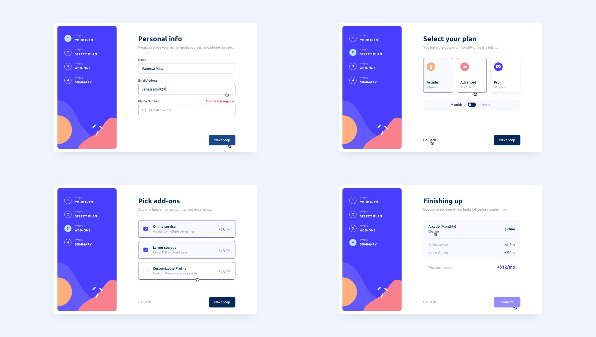
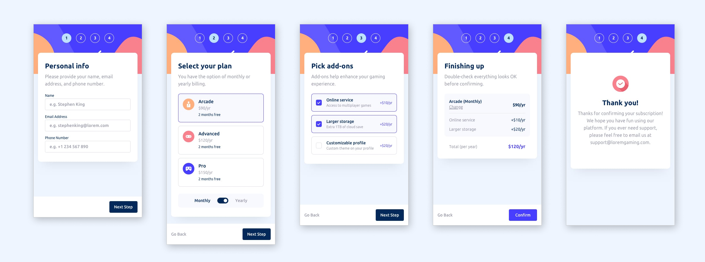

# Frontend Mentor - Multi-step form solution

This is a solution to the [Multi-step form challenge on Frontend Mentor](https://www.frontendmentor.io/challenges/multistep-form-YVAnSdqQBJ). **This multi-step form application offers a responsive, user-friendly experience with step navigation, input validation, summary confirmation, and interactive feedback, ensuring seamless usability across devices.** 

## Table of contents

- [Overview](#overview)
  - [The challenge](#the-challenge)
  - [Screenshot](#screenshot)
  - [Built with](#built-with)
  - [Links](#Links)
- [Other](#Other)

## Overview

This multi-step form application provides an intuitive and seamless user experience for completing a sequence of steps. It allows users to navigate between steps, update their inputs, and review their selections before confirming. Designed with responsive layouts and accessible interactions, the form adapts to various device sizes, ensuring optimal usability.

The multi-step form includes features such as step navigation, input validation, and summary confirmation. Users are guided through a clear sequence with visual feedback on errors or incomplete inputs. Hover and focus states enhance interactivity, while mobile-first design principles ensure compatibility across devices.

### The challenge

Users should be able to:

- Complete each step of the sequence
- Go back to a previous step to update their selections
- See a summary of their selections on the final step and confirm their order
- View the optimal layout for the interface depending on their device's screen size
- See hover and focus states for all interactive elements on the page
- Receive form validation messages if:
  - A field has been missed
  - The email address is not formatted correctly
  - A step is submitted, but no selection has been made

### Screenshot

### Built with

- Semantic HTML5 markup
- CSS custom properties
- Flexbox
- CSS Grid
- Mobile-first workflow

### Links

- Solution URL: [Add solution URL here](https://your-solution-url.com)
- Live Site URL: [Add live site URL here](https://your-live-site-url.com)

## Other

Other Projects:
- Portfolio Website - [angeline-portfolio.netlify.app](https://angeline-portfolio.netlify.app)